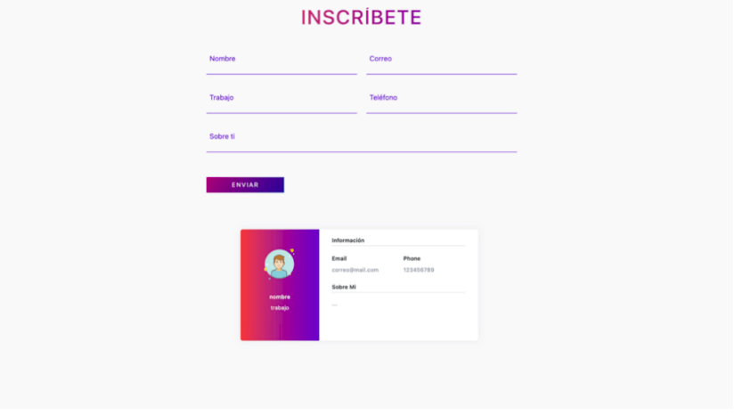

# SafeMe

EJERCICIO:
Una nueva red social llamada “SafeMe”, busca proteger la privacidad de sus usuarios. Esta empresa desea
crear una vista de inscripción, que permita al usuario ver la cantidad de información sobre ellos, a la que
otros podrán acceder, una vez inscritos. Dado que requiere del conocimiento y uso de JavaScript, te han
contratado para desarrollarla.

